<h1 align="center">基于SpringBoot的毕业生实习与就业管理系统【带论文】</h1>

- <b>完整代码获取地址：从戎源码网 ([https://armycodes.com/](https://armycodes.com/))</b>
- <b>技术探讨、资料分享，请加QQ群：692619798</b>
- <b>作者微信：19941326836  QQ：3645296857</b>
- <b>承接计算机毕业设计、Java毕业设计、Python毕业设计、深度学习、机器学习</b>
- <b>选题+开题报告+任务书+程序定制+安装调试+论文+答辩ppt 一条龙服务</b>
- <b>所有选题地址 ([https://github.com/Descartes007/allProject](https://github.com/Descartes007/allProject)) </b>

## 一、项目介绍

基于SpringBoot的毕业生实习与就业管理系统，系统角色为系统管理员、学生、教师和企业，主要功能如下
### 系统管理员：
- 基本操作：登录、修改密码、获取个人信息、修改个人信息、会话管理
- 用户管理：筛选用户信息、查看用户信息详情、新增用户、删除用户、获取用户在线状态
- 角色/权限管理：新增角色、查看角色权限、删除角色、筛选角色、获取角色列表
- 菜单管理：新增菜单信息、获取菜单信息列表、查看菜单信息详情
- 系统配置：配置项查看与修改、系统参数管理
- 公告管理：获取公告列表、发布公告、查看公告、删除公告（面向教师/企业）
- 字典管理：字典项增删改查、获取最大编码索引
- 文件管理：文件上传
### 学生：
- 基本操作：登录、注册、修改密码、获取与修改个人信息、会话管理、登出
- 个人信息管理：查看/修改个人信息、上传附件（简历等）
- 实习信息：查看实习列表、查看实习详情、申请/报名实习
- 就业信息：查看招聘信息、查看详情、投递/报名职位
- 公告查看：查看教师/企业公告
### 教师：
- 基本操作：登录、注册、修改密码、获取与修改个人信息、会话管理、登出
- 公告管理：发布公告、获取公告列表、查看公告、删除公告
- 学生管理：查看学生列表/详情、筛选学生信息
- 实习管理：发布/管理实习信息、查看实习申请
- 审核与跟进：对相关申请/信息的审核、关注/跟进记录
- 企业：
- 基本操作：登录、注册、修改密码、获取与修改个人信息、会话管理、登出
- 招聘管理：发布招聘/就业信息、获取招聘列表、查看招聘详情、删除/修改招聘
- 公告管理：发布企业公告、获取公告列表、查看公告、删除公告
- 简历/文件：接收与管理学生投递的简历、附件上传下载
- 企业信息管理：查看/修改企业信息

## 二、项目技术

- 编程语言：Java
- 项目架构：B/S（前后端分离）
- 前端技术：Vue、vue-router、、Axios、Element UI（或基于 Element 的组件库）
- 后端技术：Spring、Spring Boot、MyBatis（/MyBatis-Plus）、Maven 构建、MySQL

## 三、运行环境

- JDK版本：1.8及以上都可以
- 操作系统：Windows7/10、MacOS
- 开发工具：IDEA、Ecplise、MyEclipse都可以

## 四、数据库配置文件

- npm版本：6.14.13及以上都可以
- Redis版本：3.2.100及以上都可以
- 文件名：application.yml
- 编码类型：utf8

## 论文截图

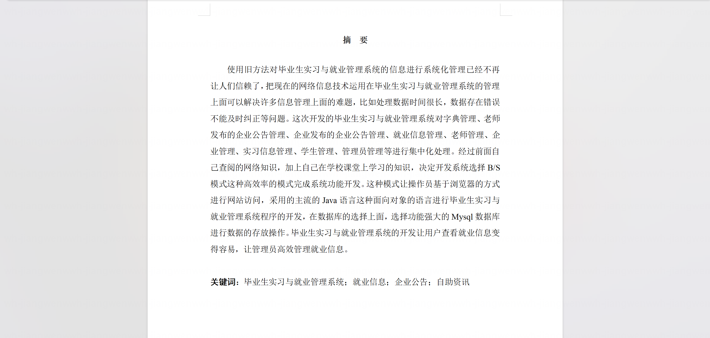

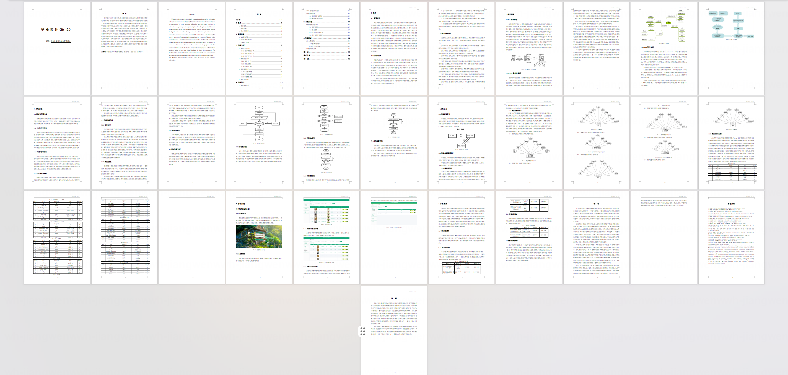

## 系统截图

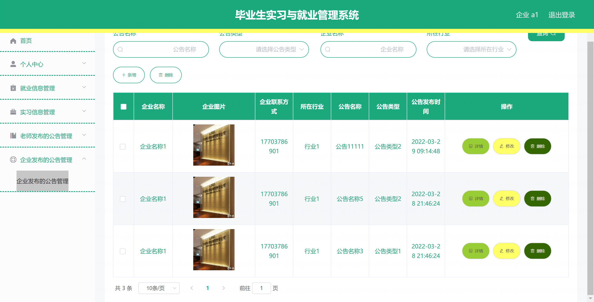

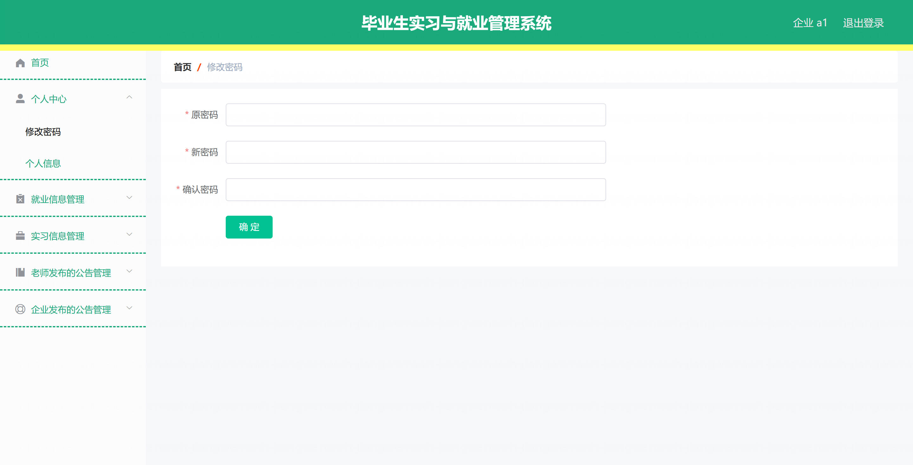

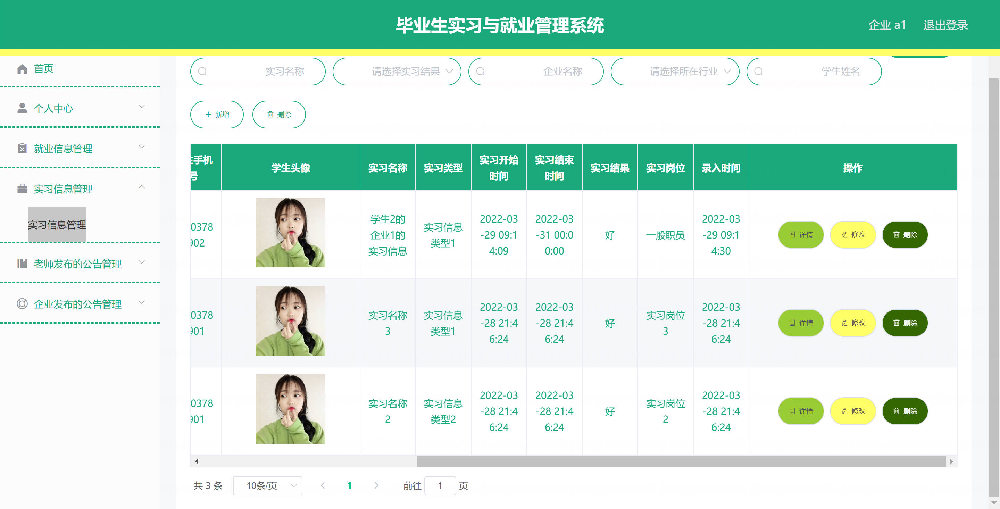

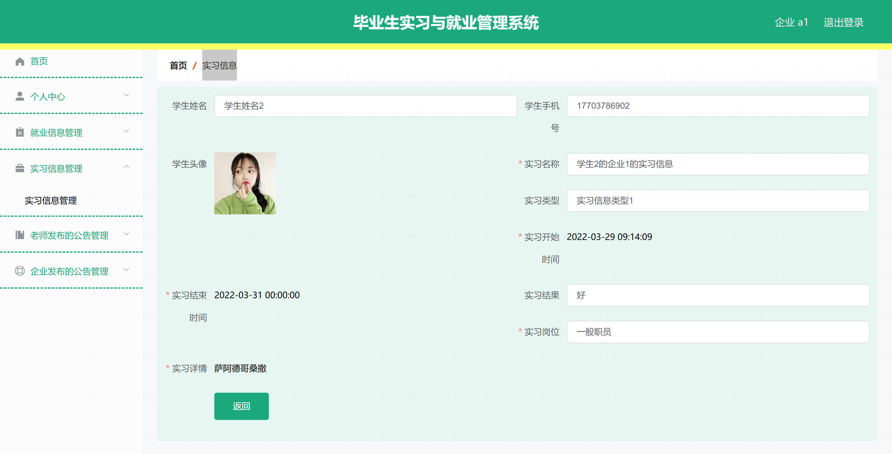

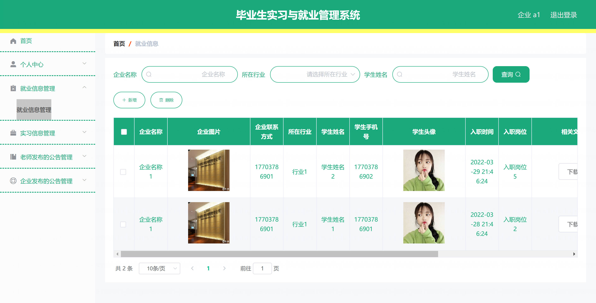

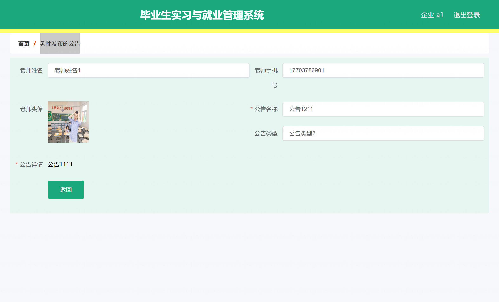

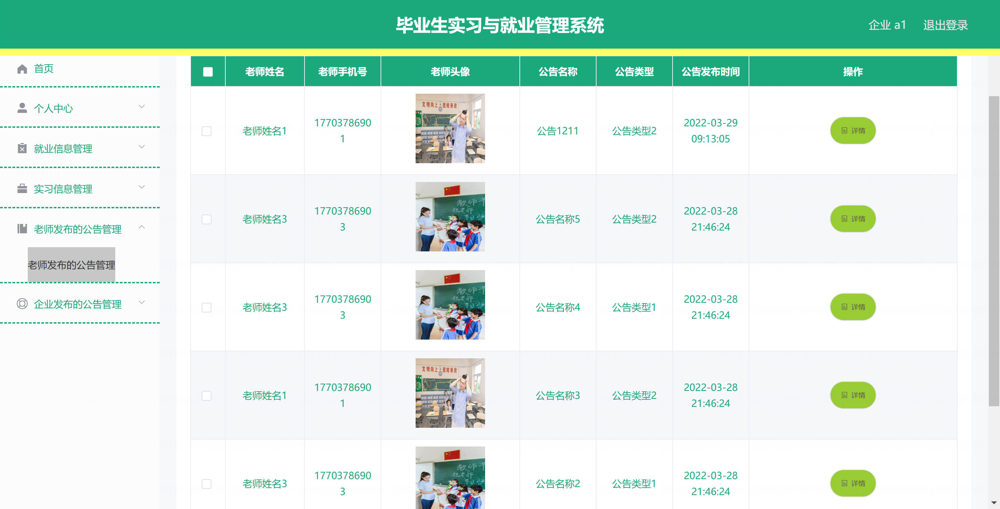

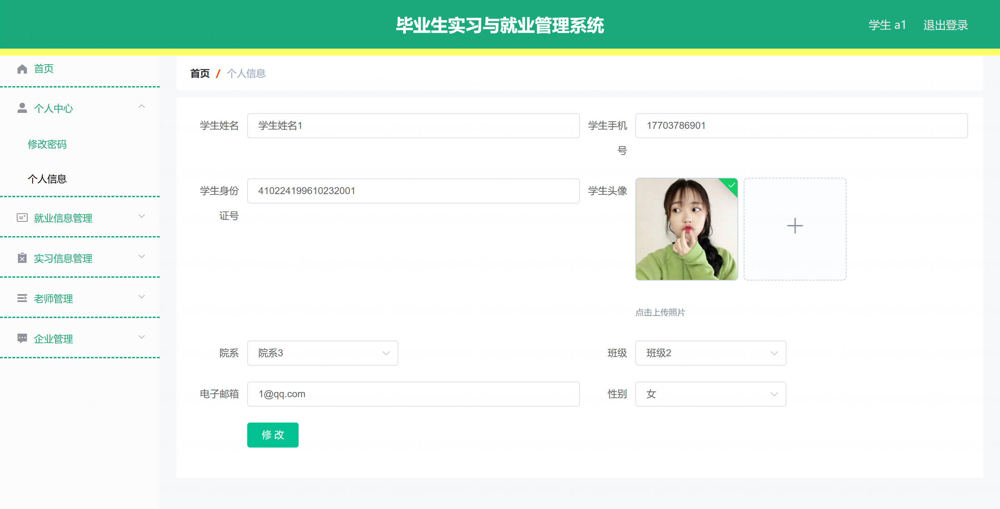

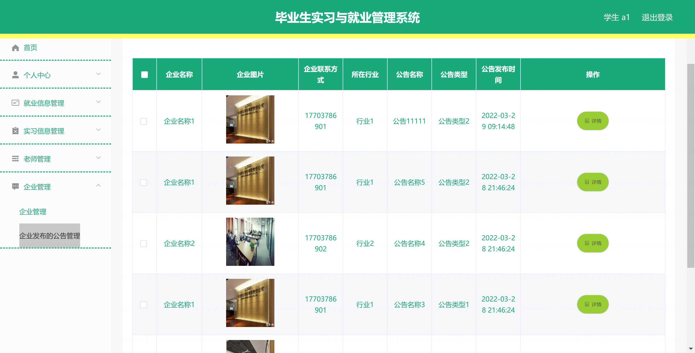

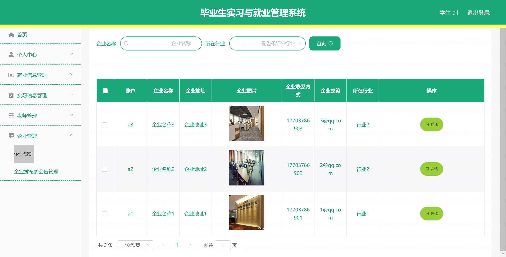
